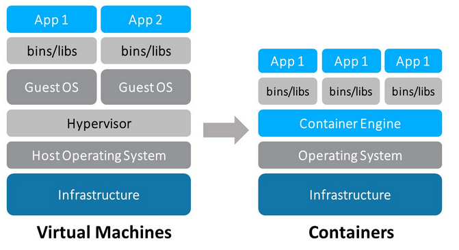

# Workshop de Docker

# Pauta

## O quê é?

Tecnologia de gerenciamento de contêineres que fornece uma camada de abstração da infraestrutura e automação de virtualização do sistema operacionais e aplicações.

## O que é container?

Container é uma forma de isolar a aplicação do sistema operacional Host, em resumo reduzindo consideravelmente o tempo de deploy e as diferenças entre ambiente de desenvolvimento e produção.

Diferente de uma máquina virtual, o sistema operacional do Container não utiliza um hardware emulado, mas sim a camada de comunicação do próprio host para acessar o Hardware (Kernel).

Um container precisa e deve ter somente o mínimo necessário pra rodar a aplicação. O que torna estes binários extremamente pequenos, quando comparados com outras formas de disponibilização de aplicações.

## Imagens e Layers

- Um Docker Image é um binário que inclui todos os requisitos necessários para rodar um Container, como se fosse um snapshot de uma VM completa, já com a aplicação instalada, pronto para rodar.
- Cada vez que o comando `docker run` é executado, uma nova máquina é criada, com base na "receita" definida pela imagem
-  Além disso, as imagens são montadas em camadas, chamadas de Layers.
-  Os layers são compartilhados entre as imagens do sistema, fazendo com que o consumo de recursos seja extremamente otimizado.
- O compartilhamento é possível pois todas as Layers do container são "somente leitura", apenas a camada mais superior é leitura e escrita
- Se alguma aplicação modifica algum arquivo de uma layer superior, o container vai copiar este arquivo para a camada superior antes de alterar. Isso é extremamente otimizado pelo sistema de arquivos do Docker

[Docker – Images vs Layers](https://gago.io/blog/docker-images-vs-layers/)

## Pra quê serve?

- Bases de Desenvolvimento
- Bases de Teste e Homologação
- Bases de Testes automatizados
- Bases de Demonstração
- Implantação rápida e padronizada
- Padronizar ambientes em produção
- Migrações e atualizações
- Agilidade na duplicação de ambientes

## Versões e Custo

- CE - Community edition: Gratuita e OpenSource
- EE - Enterprise edition
    - Suporte Dedicado
    - Validação de imagens
    - Somente imagens assinadas

Para Linux a versão EE é paga, no Windows Server 2016 e 2019 já vem embarcado (fora o suporte).

- No Windows Server, só funciona a Enterprise Edition.
- No Linux dá pra rodar a CE em produção normalmente.
- Se precisar de enterprise no Linux, é mais vantajoso migrar para uma nuvem

https://www.mundodocker.com.br/docker-ce-ee/

https://hub.docker.com/editions/enterprise/docker-ee-server-windows

https://www.mundodocker.com.br/docker-no-windows-server-2016/

## Portabilidade entre Hosts Linux e Windows

- Existem containers com SO Windows?
    - Sim, porém, imagens com base em Windows só podem ser utilizadas em Hosts Windows.

- Para rodar um container Linux dentro do Windows, é preciso uma Máquina Virtual?
    - Sim e não
    - Atualmente para Windows Server ou 10 Pro, roda sobre o WSL (Windows Subsystem for Linux). Que é um módulo padrão do sistema que permite a instalação de uma Distro Linux dentro do SO Windows, com acesso direto aos recursos de Hardware.
    - Para outros sistemas Windows (W8.1, W10 Home), vai rodar em modo de compatibilidade, sobre uma VM do VirtualBox
    - Já está liberado para W10 Insiders Preview o WSL 2. A segunda versão promete ser muito aprimorada e usará um Kernel real do Linux embarcado no Windows. Expectativa de performance aumenta em até 20x para o WSL 1.

Como o WSL 2 funciona no Windows 10 Home Edition, o Docker Desktop também funcionará.

[Docker ❤️️ WSL 2 - The Future of Docker Desktop for Windows - Docker Engineering Blog](https://engineering.docker.com/2019/06/docker-hearts-wsl-2/)

Lendo este artigo e as outras notícias é possível concluir: Para desktop, o Docker roda no Linux.
O que acontece é que agora a MS vai rodar Linux dentro do W10 mais integrado.

### Outras informações sobre WSL 2:

https://sempreupdate.com.br/microsoft-lanca-windows-subsystem-for-linux-2/

https://devblogs.microsoft.com/commandline/wsl-2-is-now-available-in-windows-insiders/

https://docs.microsoft.com/en-us/windows/wsl/wsl2-about

https://docs.microsoft.com/en-us/windows/wsl/wsl2-ux-changes

https://github.com/luizcarlosfaria/kb/wiki/Docker-no-Windows-vs-Docker-no-Linux

# Cursos e tutoriais

- https://github.com/luizcarlosfaria/kb/wiki

- [Docker Compose: simplificando o deployment de aplicações](https://gago.io/blog/2018-canal-dotnet-docker-compose/)

- [Como criar uma imagem Docker a partir de um Container utilizando o Docker commit](http://devopslab.com.br/docker-como-criar-uma-imagem-docker-a-partir-de-um-container-utilizando-o-docker-commit/)

- [How to commit changes to a docker image](https://www.techrepublic.com/article/how-to-commit-changes-to-a-docker-image/)

- [SQL Server for Linux](https://gago.io/blog/docker-de-az-16-sql-server-for-linux/)

#### Cursos de Docker (em Espanhol):

- [Curso Completo](https://www.youtube.com/playlist?list=PLn5IkU1ZhgiZl4EH7AFkqs-pqF6ZUz_iS)

- [Curso de Docker en Windows Server 2019](https://www.youtube.com/playlist?list=PLn5IkU1ZhgiZP8EewgFdxgnsIwN1q3Juo)

# Guias de Instalação

- [Windows 10 Pro](https://hub.docker.com/editions/community/docker-ce-desktop-windows)
- [Windows 10 Home ou versões anteriores](https://docs.docker.com/toolbox/overview/)

# Docker e TOTVS

https://docker.totvs.io

[Imagens prontas para montar ambiente de desenvolvimento](https://docker.totvs.io/harbor/projects/36/repositories)

[Imagens dos artefatos da engenharia](https://docker.totvs.io/harbor/projects/37/repositories)

[Dev Sandbox - Extenção para VsCode](https://code.engpro.totvs.com.br/vinicius.fragazi/dcp-extension)

[Exemplo de arquivos para montar um ambiente completo](https://totvstfs.visualstudio.com/DevCenterProtheus/_git/docker-builds)

[Imagens desde a versão 11](https://github.com/endersonmaia/totvs-protheus-docker)

[SQL Server for Linux]()

# Criando imagens próprias

- Registry
- Dockerfile
- Docker Commit
- Docker Push

# Ambientes completos e serviços

- Docker Compose
- Orquestradores (Swarm e Kubernetes)

# Brainstorm - Possíveis aplicações

### Internamente
- Scripts de automação para aplicação de Patches conforme alterado código no repositório
- Bases de teste "Congeladas" com Add-On´s e Aceleradores, para desenvolvimento/testes
- Bases para compilação automática de alterações
- Bases para execução de testes automatizados
- Bases demo para cereais e telecom
- Bases para a equipe de suporte
- Criar rapidamente ambiente para novos analistas

### Nos clientes
- Padronização de ambientes em novas implantações
- Métodos de montagem rápida de bases de teste em clientes pequenos
- Liberdade de escolha utilizarem provedores de nuvem conceituados
  - AWS
  - Google
  - Azure
  - Digital Ocean

# Riscos e Segurança

[Segurança de Containers](https://www.mundodocker.com.br/seguranca-e-hacking-de-containers-docker/)